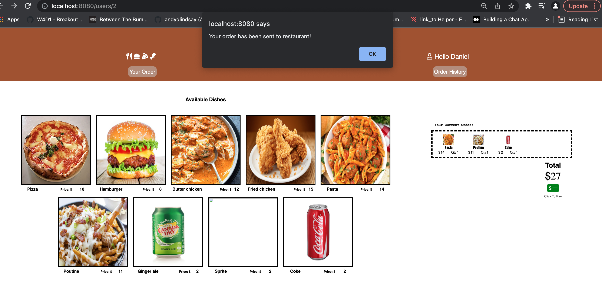
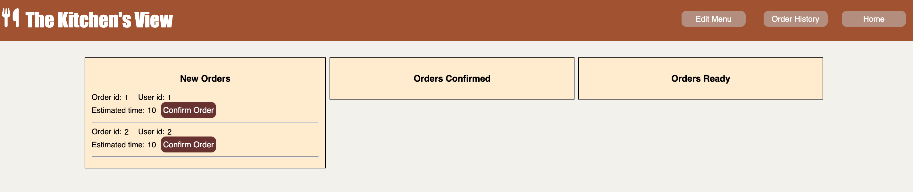
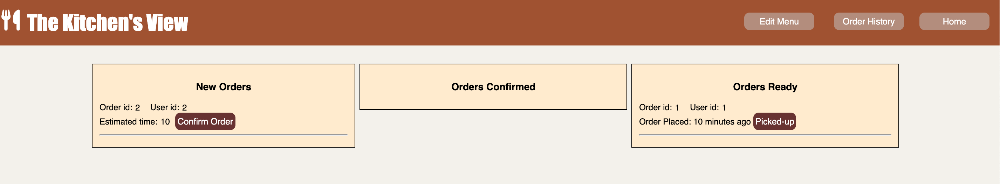
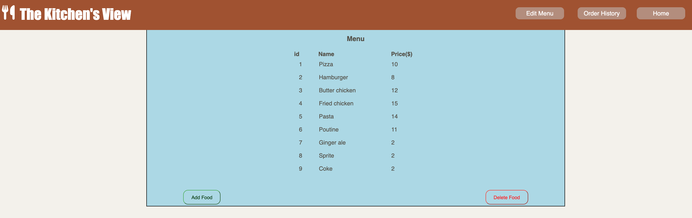

# Introduction
A food ordering experience for a single restaurant. customers can select one or more dishes and place an order for pick-up. They will receive a notification when their order is ready. The restaurant(owner) and the client both are notified since this app serves as an intermediary.

When an order is placed the restaurant receives the order via SMS. The restaurant can then specify how long it will take to fulfill it. Once they provide this information, the website updates for the client and also notifies them via SMS.

# Stack 
- NodeJS
- Express
    RESTful routes
- jQuery and css
- PostgreSQL and pg (with promises) for DBMS

# Final Product
- User page allow a user to see menu and place order

- Owner page allow an Owner to see placed orders 

- Owner page allow an Owner to confirm orders that order is processed. customer gets an SMS that his order is confirmed.
 

 - Owner page allow an Owner to confirm orders that order is ready for pickup. customer gets an SMS that his order is ready.
 

 - Owner page allow an Owner to edit (add/delete/update) menu items. 
 